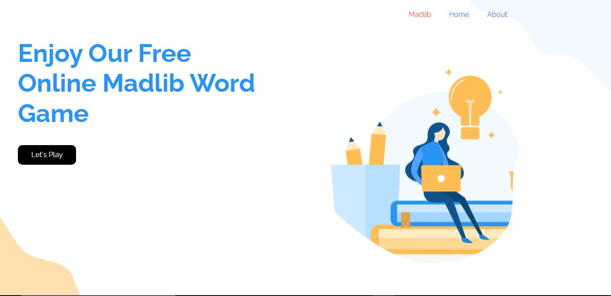

# Madlibs

Mad Libs is the world’s greatest word game and can make anyone the funniest person in the room! Mad Libs are stories with words removed and replaced by blank spaces. One player acts as the “reader” and asks the other players, who haven’t seen the story, to fill in the blanks with adjectives, nouns, exclamations, colors, adjectives, and more. These words are inserted into the blanks and thenthe story is read aloud to hilarious results. For more information visit [ http://www.madlibslive.com/whats-a-mad-lib ].

;

Additional description about the project and its features.

## Built With

- HTML
- CSS
- Bootstrap
- Javascript

## Live Demo

[Its live, play a madlib game](https://amedzro-elikplim.github.io/Madlibs/)

## Getting Started

To get a local copy up and running follow these simple example steps.

### Prerequisites

- Knowledge on basic html, css and javaScript
- Text Editor (VScode, Atom, Sublime text, etc)
- 

### Setup

- clone repository using `git clone`
- run `npm install`
- run `live server`

## Author

👤 **Amedzro Elikplim Emmanuel**

- GitHub: [@Amedzro-Elikplim](https://github.com/Amedzro-Elikplim)
- Twitter: [@ElikplimAmedzro](https://twitter.com/Amedzro-Elikplim)
- LinkedIn: [Emmanuel Elikplim Amedzro](https://www.linkedin.com/in/emmanuel-elikplim-amedzro-187590125/)

## Designer

👤 **Sharon Dassah**

- Live design: https://www.figma.com/file/dGD1hkNr6nufnV6CpnZyK6/Madlibs?node-id=3%3A2
- LinkedIn: https://www.linkedin.com/in/sharon-dassah-24b25a175/

## 🤝 Contributing

Contributions, issues, and feature requests are welcome!

Feel free to check the [issues page](../../issues/).

## Show your support

Give a ⭐️ if you like this project!

## 📝 License

This project is [MIT](./LICENSE) licensed.